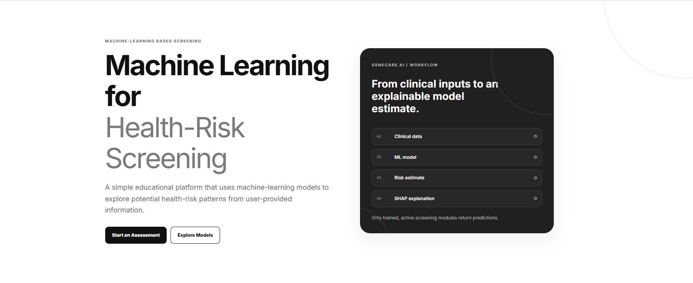
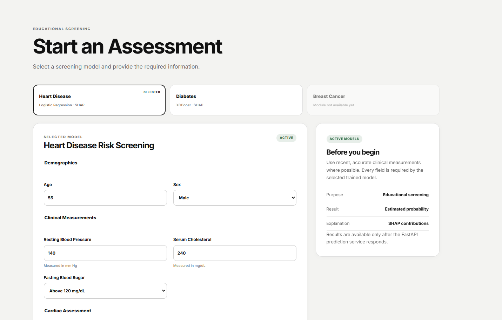
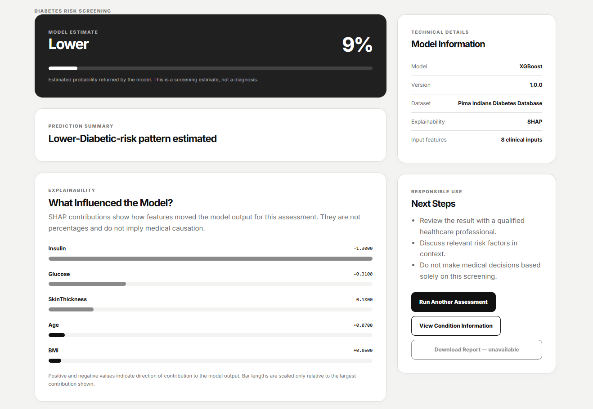
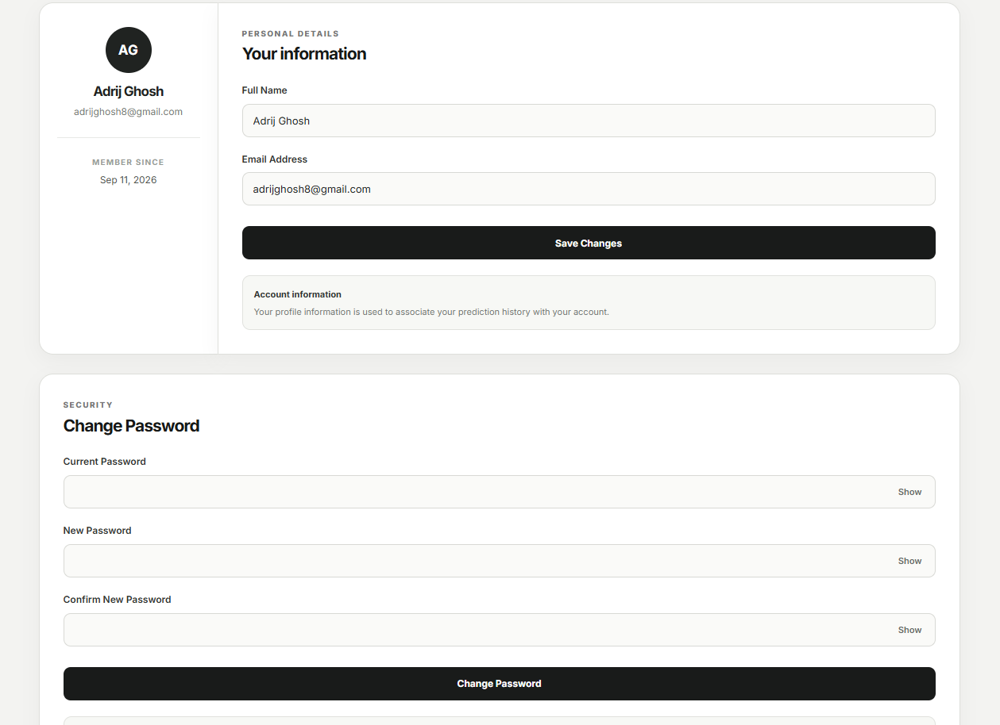

# 🧬 GeneCare AI

### AI-Powered Disease Risk Prediction & Health Intelligence Platform

<p align="center">
  <strong>Predict • Understand • Act</strong>
</p>

<p align="center">
  GeneCare AI is an intelligent healthcare platform that uses machine learning to estimate disease risk from clinical and patient-provided data, while presenting the results through a simple and accessible web interface.
</p>

<p align="center">


</p>

---

## 🌟 Overview

**GeneCare AI** is a machine-learning-based healthcare application designed to provide preliminary disease-risk predictions using patient and clinical information.

The platform combines:

* 🤖 Machine Learning
* 🧬 Healthcare Data
* 📊 Predictive Analytics
* 🌐 Web Technologies
* 🔐 User Authentication
* 📈 Prediction History
* 👤 User Profiles

The goal is not to replace medical professionals, but to demonstrate how machine learning can be integrated into a practical healthcare-oriented application.

---

## 🖥️ Application Preview

### 🏠 Dashboard

<p align="center">
  
</p>

> The central dashboard provides access to disease prediction modules and user-specific health information.

---

### 🧬 Disease Prediction

<p align="center">
  
</p>

> Users provide the required clinical parameters and receive an AI-generated risk prediction.

---

### 📊 Prediction Result

<p align="center">
  
</p>

> Results are presented in a simple format designed to make model output easier to understand.

---

### 👤 User Profile

<p align="center">
  
</p>

> Users can manage their profile information and access their personalized application data.

---

## ✨ Key Features

| Feature                        | Description                                                   |
| ------------------------------ | ------------------------------------------------------------- |
| 🧬 Disease Prediction          | Machine-learning models estimate disease risk from input data |
| 👤 User Authentication         | Secure registration and login system                          |
| 🔐 Session Management          | User sessions are maintained through the backend              |
| 📊 Prediction History          | Previous predictions can be stored and reviewed               |
| 👨‍⚕️ Multiple Disease Modules | Architecture supports multiple prediction models              |
| 📱 Responsive UI               | Designed to work across desktop and smaller screens           |
| ⚡ REST API                     | Frontend communicates with the backend through API endpoints  |
| 🗄️ Database Integration       | User and prediction information can be persisted              |
| 📈 ML Pipeline                 | Data preprocessing and prediction are handled systematically  |

---

# 🩺 Supported Disease Prediction

GeneCare AI is designed as a modular platform, allowing individual disease prediction systems to be added without rebuilding the entire application.

| Disease            | ML Model             | Input Type          | Status                    |
| ------------------ | -------------------- | ------------------- | ------------------------- |
| ❤️ Heart Disease   | Classification Model | Clinical Parameters | ✅ Available               |
| 🫁 Breast Cancer   | Classification Model | Diagnostic Features | 🚧 Integrated / Expanding |
| 🧬 Future Diseases | ML Models            | Disease-specific    | 🔮 Planned                |

> The architecture is intentionally modular so that additional disease prediction models can be integrated independently.

---

# 🧠 How GeneCare AI Works

```text
                ┌──────────────────────┐
                │       User           │
                └──────────┬───────────┘
                           │
                           ▼
                ┌──────────────────────┐
                │   Web Interface      │
                │   HTML / CSS / JS    │
                └──────────┬───────────┘
                           │
                           ▼
                ┌──────────────────────┐
                │      Flask API       │
                └──────────┬───────────┘
                           │
              ┌────────────┴────────────┐
              ▼                         ▼
    ┌──────────────────┐      ┌──────────────────┐
    │ Data Validation   │      │ Authentication   │
    └────────┬─────────┘      └──────────────────┘
             │
             ▼
    ┌──────────────────┐
    │ Preprocessing    │
    └────────┬─────────┘
             │
             ▼
    ┌──────────────────┐
    │ ML Prediction    │
    │      Model       │
    └────────┬─────────┘
             │
             ▼
    ┌──────────────────┐
    │ Prediction       │
    │ Result           │
    └────────┬─────────┘
             │
             ▼
    ┌──────────────────┐
    │ Database /       │
    │ Prediction       │
    │ History          │
    └──────────────────┘
```

---

# 🏗️ System Architecture

GeneCare AI follows a **frontend–backend–ML architecture**.

### Frontend

Responsible for:

* User interface
* Forms
* Navigation
* Authentication screens
* Prediction input
* Result visualization

### Backend

Responsible for:

* API routing
* Authentication
* Input validation
* Database operations
* Model loading
* Prediction generation

### Machine Learning Layer

Responsible for:

* Data preprocessing
* Feature transformation
* Model inference
* Disease-risk classification

### Database Layer

Responsible for:

* User information
* Authentication-related data
* Prediction records
* Historical results

---

# 🛠️ Tech Stack

| Layer               | Technology                                    |
| ------------------- | --------------------------------------------- |
| Frontend            | HTML5, CSS3, JavaScript                       |
| Backend             | Python, Flask                                 |
| Machine Learning    | Scikit-learn                                  |
| Data Processing     | Pandas, NumPy                                 |
| Model Serialization | Joblib                                        |
| Database            | SQLite                                        |
| Authentication      | Flask-based authentication/session management |
| Version Control     | Git & GitHub                                  |

---

# 📂 Project Structure

```text
GeneCare_AI/
│
├── backend/
│   ├── app.py
│   ├── database.py
│   ├── models/
│   │   ├── heart_model.pkl
│   │   └── breast_cancer_model.pkl
│   │
│   ├── routes/
│   ├── services/
│   └── utils/
│
├── frontend/
│   ├── index.html
│   ├── login.html
│   ├── register.html
│   ├── dashboard.html
│   ├── prediction.html
│   ├── result.html
│   ├── profile.html
│   │
│   ├── css/
│   │   └── style.css
│   │
│   └── js/
│       └── script.js
│
├── data/
│   └── datasets/
│
├── notebooks/
│   └── model_training.ipynb
│
├── docs/
│   └── images/
│
├── requirements.txt
├── README.md
└── .gitignore
```

> The exact structure may vary as the project evolves.

---

# ⚙️ Machine Learning Pipeline

GeneCare AI follows a standard machine-learning workflow:

```text
Raw Dataset
     │
     ▼
Data Cleaning
     │
     ▼
Exploratory Data Analysis
     │
     ▼
Feature Selection
     │
     ▼
Data Preprocessing
     │
     ▼
Train / Test Split
     │
     ▼
Model Training
     │
     ▼
Model Evaluation
     │
     ▼
Model Serialization
     │
     ▼
Flask API
     │
     ▼
Prediction
```

---

# 📊 Model Evaluation

Models are evaluated using multiple performance metrics rather than relying only on accuracy.

| Metric    | Purpose                                   |
| --------- | ----------------------------------------- |
| Accuracy  | Overall proportion of correct predictions |
| Precision | Reliability of positive predictions       |
| Recall    | Ability to identify actual positive cases |
| F1 Score  | Balance between precision and recall      |
| ROC-AUC   | Overall discrimination capability         |

Example evaluation format:

| Model   | Accuracy | Precision | Recall | F1 Score | ROC-AUC |
| ------- | -------: | --------: | -----: | -------: | ------: |
| Model 1 |        — |         — |      — |        — |       — |
| Model 2 |        — |         — |      — |        — |       — |
| Model 3 |        — |         — |      — |        — |       — |

> Final values should be added from the validated experimental results.

---

# 🔌 API Architecture

The frontend communicates with the Flask backend through REST-style endpoints.

| Method | Endpoint       | Purpose                     |
| ------ | -------------- | --------------------------- |
| `POST` | `/register`    | Create a new user           |
| `POST` | `/login`       | Authenticate user           |
| `POST` | `/logout`      | End user session            |
| `GET`  | `/profile`     | Retrieve profile            |
| `PUT`  | `/profile`     | Update profile              |
| `POST` | `/predict/...` | Generate prediction         |
| `GET`  | `/history`     | Retrieve prediction history |

> Endpoint names should be updated if the implementation differs.

---

# 🚀 Installation

## 1. Clone the Repository

```bash
git clone https://github.com/adrijghosh8/genecare_ai.git
cd genecare_ai
```

## 2. Create a Virtual Environment

### Windows

```bash
python -m venv venv
venv\Scripts\activate
```

### macOS / Linux

```bash
python3 -m venv venv
source venv/bin/activate
```

## 3. Install Dependencies

```bash
pip install -r requirements.txt
```

## 4. Configure Environment Variables

Create a `.env` file:

```env
SECRET_KEY=your-secret-key
DATABASE_URL=your-database-url
```

> Never commit secret keys, passwords, API keys, or other credentials to GitHub.

## 5. Start the Backend

```bash
python app.py
```

The backend will start on the configured local server.

## 6. Open the Frontend

Open the frontend through your configured development server or browser setup.

---

# 🔒 Security

GeneCare AI includes basic application-level security practices such as:

* Password-protected authentication
* Session management
* Environment variables for secrets
* Input validation
* Separation of frontend and backend responsibilities
* `.gitignore` protection for sensitive files

For production deployment, additional security measures should be implemented.

---

# 📈 Future Improvements

The project can be extended with:

* 🧬 More disease prediction models
* 🧠 Advanced ensemble models
* 📊 Interactive health analytics
* 📱 Mobile application
* ☁️ Cloud deployment
* 🔐 Stronger authentication
* 👨‍⚕️ Doctor / healthcare-provider dashboard
* 📄 Downloadable prediction reports
* 🧠 Explainable AI using SHAP/LIME
* 📈 Model monitoring
* 🔄 Automated model retraining
* 🗃️ Scalable production database

---

# 🎯 Project Goals

GeneCare AI aims to demonstrate how machine learning can be transformed from a standalone model into a complete software application.

Instead of only training a model inside a notebook, the project focuses on the complete pipeline:

> **Dataset → ML Model → Backend API → Database → User Interface → Prediction**

This makes GeneCare AI both a machine-learning project and a full-stack application.

---

# ⚠️ Medical Disclaimer

**GeneCare AI is an educational and research project.**

Predictions generated by this application are intended for demonstration and research purposes only and **must not be considered a medical diagnosis or a substitute for professional medical advice**.

Users should always consult a qualified healthcare professional for medical decisions, diagnosis, treatment, or interpretation of health information.

---

# 🤝 Contributing

Contributions, suggestions, and improvements are welcome.

```bash
# Fork the repository
# Create a feature branch
git checkout -b feature/your-feature

# Commit your changes
git commit -m "Add your feature"

# Push the branch
git push origin feature/your-feature

# Open a Pull Request
```

---

# 📜 License

This project is intended for educational and research purposes.

Add an appropriate open-source license such as **MIT License** if you decide to make the project officially open source.

---

# 👨‍💻 Author

### Adrij Ghosh

Computer Science Student | Machine Learning & Full-Stack Development

<p align="center">

**Building technology at the intersection of AI, healthcare, and software engineering.**

</p>

---

<p align="center">

### ⭐ If you found GeneCare AI interesting, consider giving the repository a star!

**GeneCare AI — Predict • Understand • Act**

</p>
